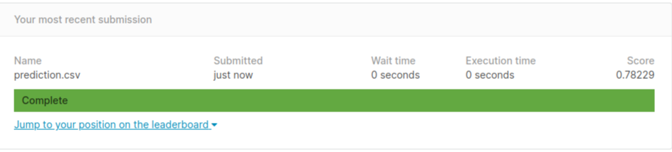

# shovel
This repository contains my data mining course homeworks.
The homeworks of this course seem useful and interesting so I decided to tell you what is going on so you can practice too

# HW1
There is a file named covid.csv that contains information about people suffering from COVID-19 in south korea.<br/>
1. I read this file using **pandas** library
2.  This dataset is small and contains only 176 records, these are the columns

|id     |  sex   |birth_year |country  | region  |infection_reason |infected_by |confirmed_date | state  |
|-------|:------:|:---------:|:-------:|:-------:|:---------------:|:----------:|:-------------:|-------:|
|nominal| nominal| interval  | nominal | nominal |    nominal      |    ratio   |    interval   | nominal|
|-------|:------:|:---------:|:-------:|:-------:|:---------------:|:----------:|:-------------:|-------:|
| 0 nan | 0 nan  |  10 nan   | 0 nan   | 10 nan  |     81 nan      |  134 nan   |      0 nan    |  0 nan |

3. It is asked to find max, mean and std of the column birth_year<br/>
the max is 2009<br/>
Let me talk about finding mean, this column has null values and I can have different strategies facing them I calculated
the mean using two ways:<br/>
first: We can think that the null values don't exist and calculate the mean, mean() function of pandas dataframe does 
that, the mean is 1973.3855<br/>
second: I can change the pandas dataframe to a numpy array and then calculate the mean but the mean() function of numpy
array ignore the null values so I have to substitute them with a number for example zero, the mean is 1861.2613.<br/>
everything I said about mean remains the same for std. I calculated std just using pandas dataframe std function<br/>
std: 17.0328

4.yes, null values exist in the dataset.<br/>
The question is to remove the null values by a proper method but what the proper method?? if the dataset was huge and the
null values were few I would remove the records which have null values but our case is completely the opposite so I should
substitute the null values with a value. **pay attention**: sometimes a column contains null values that I don't want to 
select in feature selection or I sometimes even use a method that can handle null values but in this question we assume
that we don't want to put aside any column and our method cannot handle null values. In my opinion the best way to 
substitute null values of **numerical** columns is to put the median value instead of them **Note**: I prefer to use median
over mean cause it's more resistant to outliers. For **nominal** columns I substitute the null values with the most frequent
value.<br/>
**trouble alert**: There is column in our dataset that has date time values, it's logical to use median strategy for this
column but the SimpleImputer class that I use considers this column as string and cannot find the median I thought of two
solutions, I can find the median `df['confirmed_date'].astype('datetime64[ns]').quantile(.5)` and then use SimpleImputer
with constant strategy or I can convert the column to timestamp before passing it to SimpleImputer, the second approach 
is easier.

5. visualize data<br/>
First, I want to plot the histogram of some columns, I think the birth year and infected by columns are the most appropriate
and plotting the histogram of the other columns don't give us any information (for example id column :joy:).<br/>
Second, I'd like to plot a scatter plot so I need to choose two columns, let's find the correlation between birth_year and
confirmed_date

6. Here we like to detect and remove outliers, even if you have not studied a single book you may think of sorting or
visualizing the data and easily seen and remove outliers for datasets like the one we have in here this approach really 
works but most of the time the dataset is huge and you may prefer more automatic ways like:<br/>
1. Inter Quartile Range (IQR): Look at the code below 
```sh
import numpy as np
Q1 = np.quantile(data,0.25)
Q3 = np.quantile(data,0.75)
IQR = Q3 - Q1
```
2. Z-Score<br/>
In any distribution, about 95% of values will be within 2 standard deviations of the mean and 99.7% of the data within 3.
Based on this, any absolute value of z-score above 3 is considered as an outlier.<br/>
Z-score is calculated by substracting the mean and dividing by std<br/>
I treat with outliers like null values and substitute them with median

### linear regression
While reading the dataset using pandas I found out there are ';' instead of ',' so I wrote a bash script to solve this 
problem<br/>
1. I extract G3 as Y
2. I split the dataset to train and test
3 fit a linear regression model (as easy as a piece of cake) **Note**: we have nominal columns in our dataset which 
obviously linear regression cannot handle so we should transform these nominal values to numerical value before fitting 
the model
##### Encoding
Let me explain how I think completely, our nominal columns are school, sex, address, femsize, Pstatus, Mjob, Fjob, reason,
guardian, schoolsup, famsup, paid, activities, nursery, higher, internet, romantic.<br/>
the categorical attributes generally fall into three groups (it's my grouping):<br/>
1. binary: they can have only two possible values we can consider one them as zero and the other as one, in our dataset 
these are binary: school, sex, address, femsize, Pstatus, schoolsup, famsup, paid, activities, nursery, higher, internet, romantic
2. ordinal: they can have multiple categorical values but you can see an order among them for example
Like,Like Somewhat,Neutral,Dislike Somewhat,Dislike, it's obviously seen that 'Like' is much closer to 'Like Somewhat' than 
'Dislike' so the differentiate of the numbers I assign to 'Like' and 'Like Somewhat' should be less than the differentiate 
of 'Like' and 'Dislike' (you get the point!) none of our attributes is ordinal
3. nothing : they can have multiple categorical values but there is no order, in this case it's not reasonable to assign 
numerical values to the values cause the values which get closer numbers will have lower distance from each other though 
it's not correct.Mjob, Fjob, reason and guardian of our dataset are form this group **Solution**: we can use OneHotEncoding,
this strategy converts each category value into a new column and assigns a 1 or 0 (True/False) value to the column


4. Predict test data
5. Find accuracy<br/>
I use mean squared error for this purpose, the mse was 5.7495
 
 
# HW2 Q6
Working with titanic dataset.

### 1. Read the dataset using pandas library


### 2. Do something about the null values
I may change my opinion in future but with the knowledge I have right now I guess the best way is to replace the null 
values of the embarked column with the mode of the column (it has only 2 null values and replacing mode can be a good guess),
It's hard to say which column is more important in our prediction at the moment but I guess age can affect our prediction
a lot so I try not to remove the column and I use median values for the null ones but the null values of the "cabin" column
is so many that I think the column doesn't worth keeping. 

### 3. Get deeper to the dataset

#### Non numerical columns and decision tree
We'd like to use a decision tree to classify passengers and the decision tree classifier from sklearn library cannot work
with categorical values so we have to transform the categorical columns to numerical. I divide categorical columns into 
two groups, the ones which we can arrange in an order and the ones which we cannot. I use ordinal encoder for the first
group and one hot encoder for the second one. Now let's take a look at the categorical columns:<br/>
###### Name : 
At first I thought of dropping this column, how can names affect our prediction??!! no body stays alive because of
his/her name but it's a little trickier I found two points hidden in names first: we can find families using names and 
cause families travel together it's probable to say they all survive together or they all not, second: some words like
Miss. and Mrs. are specified in this column which gives us a sense to estimate his/her age so we can fill the null values
in the age column in a more proper way. We Asians may not be familiar with western names I've searched for it and write 
some points for you.<br/>
Look at this example:<br/>
**Baclini,Mrs.Solomon (Latifa Qurban)**<br/><br/>
**Mrs.** indicates that she is married<br/><br/>
**Solomon** is the name of her husband. This is an old-ish custom where wives can be referred to by therir husband names. 
For instance, if Jane Smith was married to John Smith, she could be referred to as Mrs.John Smith.<br/><br/>
**Latifa** is her first name.<br/><br/>
**Qurban** is her "maiden" name. This is the last name that she had before getting married.<br/><br/>
**Baclini** is her married last name(the last name of her husband)<br/><br/>
I take another example:<br/><br/>
**Baclini,Miss.Marie Catherine**<br/><br/>
Miss indicates that she is unmarried.<br/><br/>
In this **Marie** is her first name, **Catherine** is her middle name and **Baclini** is the last name.<br/><br/>
**Mr.** (for men of all the ages)<br/><br/>
**Master.** (for male children)<br/><br/>
We have other words like Dr., Sir., Col. and ... it's hard to separate each of them apart so I call all of them 
professional and I guess their age should be relatively high.<br/>
Let's sum it up I think first name and middle name have nothing to do with the passenger's survival but the last name can
help us find out families and the Mr. etc. words help us fill null ages.<br/><br/>
**Note**: Finding last name for married women is tricky actually they have two last names and those are both important 
cause they may have a trip with their husband or parents. I may change my code in future but to make it simple I just 
consider their married last name. 
<!-- I don't separate last names for now this will make so many columns -->

Sex : There is no sex order but this column takes only two values so I prefer to use ordinal encoder over one hot encoder
which increases the number of my columns.<br/>  

Ticket : Tickets have 1. an optional string prefix and 2. a number except for the special cases Ticket='LINE. Ticket prefix 
tells you who the issuing ticket office and/or embarkation point was. Ticket number can be compared for equality that
tells you who were sharing a cabin or travelling together, or compared for closeness. The ticket = LINE have been assigned 
to a group of American Line employees for free<br/>  

Embarked: This column can take three values 'C', 'Q', 'S' which I think have no order, so I use one hot encoder

### 4. Missing values in the test dataset
I strongly recommend splitting your dataset to train and test as soon as possible and don't look at the test data at all,
if you do that you may have null values in the test data. To remove them I used the data in the training dataset for example
if age is null in the test data I filled it with the average of age in the train data.

### 5. Score in kaggle


# HW2 Q7
Working on heart-disease-uci dataset.

### Taking a look at the columns
**age**<br/>
**sex**: (1 = male, 0 = female)<br/>
**cp** : chest pain type<br/>
**trestbps** : resting blood pressure (in mm Hg on admission to the hospital)<br/>
**chol** : serum cholestoral in mg/dl<br/>
**fbs** : fasting blood sugar &gt; 120 mg/dl (1 = true; 0 = false)<br/>
**restecg** : resting electrocardiographic results<br/>
**thalach** : maximum heart rate achieved<br/>
**exang** : exercise induced angina (1 = yes, 0 = no)<br/>
**oldpeak** : ST depression induced by exercise relative to rest<br/>
**slope** : the slope of the peak exercise ST segment<br/>
**ca** : number of major vessels (0-3) colored by flourosopy<br/>
**thal** : 3 = normal, 6 = fixed defect, 7 = reversable defect<br/>
**target** : 0 or 1

### Normalize data 
Normalizing data is important when we want to calculate distance among data records, for example
normalizing is not important in decision tree models cause we are not going to calculate any distance but it's too important
in models like regression and knn.<br/>
Normalizing means standardizing features by removing the mean and scaling to unit variance.<br/>
To normalize the dataset I used StandardScaler() to **fit and transform** the data then I used the StandardScaler object 
I had gotten to **just transform** the test data.<br/>
Accuracy reached to 86% from 65% just by normalizing the data.

[comment]: <> (# dependant columns)

[comment]: <> (an idea I have not used till now is to check if columns depend on each other and use it to drop one )

[comment]: <> (### Correlation)

[comment]: <> (correlation shows if two features have a linear relationship)

[comment]: <> (### Entropy)

[comment]: <> (Average information of a variable)

[comment]: <> (### Mutual Information)

[comment]: <> (MI = H&#40;x&#41; + H&#40;y&#41; - H&#40;x, y&#41;)

[comment]: <> (I checked to see the MI between columns here are the ones which have MI bigger than 1)

[comment]: <> (![]&#40;MI.png&#41;)

[comment]: <> (It seems that chol and thalach are so much dependant)

[comment]: <> (we reached to the place that I don't know what to do any further of course there are other things we should which I may )

[comment]: <> (even have the knowlodege but I don't know how to use them so I search about this dataset and tell you what I found)

### Wrong data
At first, I thought this dataset doesn't contain any NaN values BUT this dataset has some wrong values which we should 
put NaN instead.<br/>

Let's see the number of unique values in each column<br/>


Look!!!, there are two columns that seem strange:<br/>
after [investigating the columns](#taking-a-look-at-the-columns) we know that **'ca'** ranges from 0 to 3, so it should have 
only 4 unique values, but it has five :flushed: so there should be a wrong value which needs to be cleaned.
```sh
X_train['ca'].unique()
```
the above code shows that this column has an unaccepted value '4', so I substituted the value '4' with NaN.<br/>

The same thing happens for 'thal' column too [this header](#taking-a-look-at-the-columns) says this column can only take
values from 1 to 3 but, this column contains 4 unique values so like what I did for 'ca' column every value other than 1 to 3 
should be changed to null.

### Explain thal column a little more
Basically it is a radioactive element injected into the bloodstream of the patient. Then the blood flow of the patient is 
observed while they are doing exercise and resting.
- 0 maps to null in the original dataset
- 1 maps to 6 in the original dataset. This means that a fixed defect was found.
- 2 maps to 3 in the original dataset. This means that the blood flow was normal.
- 3 maps to 7 in the original dataset. This means that a reversible defect was found.

### Check for duplicate rows
```shell
X_train.drop_duplicates()
```

# Deal with outliers
Let's use box plots 
```shell
X_train.plot(kind='box', subplots=True, layout=(2, 7), sharex=False,
             sharey=False, figsize=(20, 10), color='deeppink')

plt.show()
```


I can either drop the outliers or assign a new value. I chose the first option.

### Models
Accuracy on knn model was 83%
Accuracy on gaussian naive bayes was 90%

### Different naive bayes models
There are two naive bayes models explained below
#### Multinomial Naive Bayes
used for discrete data
#### Gaussian Naive Bayes
used for continuous data

# HW3 Q8
I am going to work with titanic dataset again, I have done the preprocessing in [HW2 Q6](hw2-q6) so I can simply use my
new model. I want to use random forest tree model.
1. max_depth=5, criterion=gini<br/>
   
2. max_depth=5, criterion=entropy<br/>
   
3. max_depth=10, criterion=gini<br/>
   
4. max_depth=10, criterion=entropy<br/>
   
   
**Comparing random forest model with decision tree:** In [HW2 Q6](hw2-q6) my decision tree had max_depth=5 and criterion=
gini, the accuracy was 77%, the forest classifier with the same parameters gave accuracy= 77%.

**Comparing speed of learning:**<br/>
I used time.start and time.end to calculate the time of learning.<br/>
decision tree learning time was 0.0022056102752685547<br/>
random forest learning time was 0.10478830337524414

# HW3 Q9
I'm going to work with titanic dataset again. In this part I wanna use SVM for classification.
1. SVM with linear kernel function:<br/>


As you see, the accuracy of linear SVM model is less than the decision tree and random forest models, this shows that the 
data we have is not linearly separable.

2.SVM with non linear kernel function:<br/>
2-1. poly<br/>

2-2. rbf


# HW4 Q1
I want to implement k-means algorithm.<br/>
1. Illustrating datasets


# One time for always solve the problem SettingWithCopyWarning
